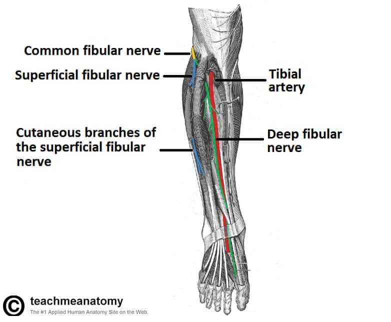
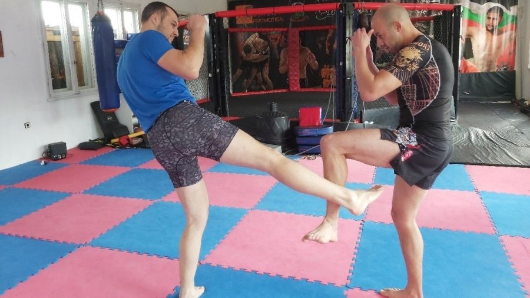
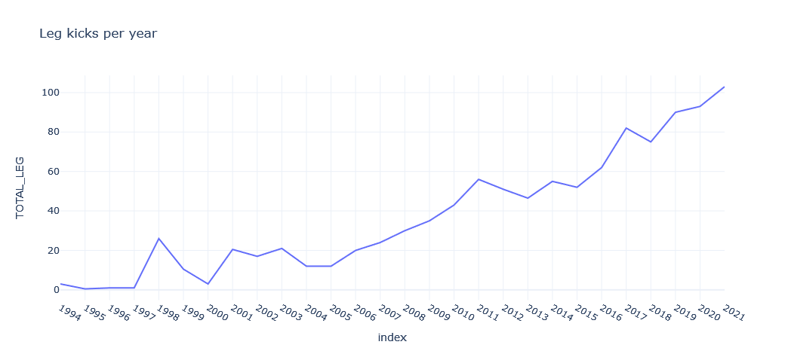

# Are calf kicks taking over modern UFC?
MMA UFC Dataset from [Kaggle](https://www.kaggle.com/datasets/rajeevw/ufcdata/versions/2?resource=download)

This small project started as a pet project to understand the evolution of lower body attacks in UFC. As a fan, I couldn't stop notice the rise of the calf kicks and leg checks. This made me question whether this was a new trend in UFC or has it been there forever. I decided to answer to my own question using a statistical approach.

A way I found to answer this curiosity was to find a suitable dataset for the purpose. I was able to find a dataset from Kaggle which was parsed from the ufcstats website using beautifulsoup. The data include stats from different oponents, represented as R for red fighter and B for blue. R_ and B_ prefix signifies red and blue corner fighter stats respectively.

# Background of leg kicks

The shinbone is one of the largest bones in the body but its not as sturdy as other bones. Elite boxers can generate a huge amount of force with kicks, much more than any punch could ever deliver. A direct it to soft tissue or bone can be very damaging and painful. Most fighters have contioned themselves to desensitivize shins by hitting their shinbon on purpose with bottles, metal poles, or heavy bags. This makes the fibers of the bone grow denser and scar tissue to build around it. The nerves around the bones deaden and dull the pain.

## Peroneal Nerve

The target are for these kicks is the area below the knee where the peroneal nerve travels exposed to the skin surface. It is also here that this nerve splits into the superficial peroneal nerve and deep peroneal nerve. These nerves supply sensation to the outside of the shin and foot.

The superficial peroneal nerve powers the muscles responsible for ankle rotation and the deep peroneal nerve powers the muscle responsible for dorsiflexion and toes. Damaging these nerves not only causes excruciating pain but nullifies the fighers stance, as he isn't able to properly stand his balance.

## Leg Checks

Leg checks are a defense mechanism to block and mitigate leg kicks. A good leg check is done with the upper part of the shin bone or knew, by oposing the strongest bone against the kickers weakest part such as the bottom tibia. The leg checks can be used for high kicks that target the femur or low kicks.

The technique follows[[1]](#1):
- Lift the front leg vertically
- Rotate the hip outwards at a 45 angle, allowing the force of the strike to be transferred to your hips rather than leg and thus keeping balance)
- Flex the foot around the shin area contracting the muscles around the shin area, providing extra protection to the bone

## Data visualization

We can visually inspect the data set for the existance of a trend. The data visualization methods while not statistically relevant are still important for the users to understand the data. 

## Mann-Kendall test [[2]](#2)

M-K test will be used to evaluate if there is a trend in a time series.
> The Mann Kendall Trend Test (sometimes called the M-K test) is used to analyze data collected over time for consistently increasing or decreasing trends (monotonic) in Y values.

### How it works:

- $H_0$: No monotonic trend
- $H_\alpha$: Upward monotonic trend (One sided), positive monotonic trend is present
- $H_\alpha$: Downward monotonic trend (One sided), positive monotonic trend is present
- $H_\alpha$: Upward or downward monotonic trend (Two sided sided)

Assumptions:

Because this is a non parametric test we do not require to make prior distribution test. The algorithm doesn't require a lot of data points either and can work well with just 4 or 5 data points. However, some key assumptions are required when processing the data:

- Each data point should represent a single time frame. If there's a case where multiple time points are retrieved per time period (year, day, month), a representative number should be used instead. The authors suggest the median as the least biased number.
- The variation of the sampling depth should not be large enough to produce bias in itself. For example, considering different time periods, where the sampling size varies greatly (ex. 1 sample vs 10 samples) there can be some bias induced either because the 1 combat was not a good representation (outlier) or because the value chosen to represent the 10 samples is not meaningful (altough it should be mitigated with robust estimators such as median vs mean).
  > In statistics, sampling bias is a bias in which a sample is collected in such a way that some members of the intended population have a lower or higher sampling probability than others.
  
  An inate source of bias is the natural selection of some fighters, which due to multiple reasons can have more fights per year than others.

 ### Approaches to statistically test this hypothesis:

 - Test the evolution of the total leg attacks using Mann-Kendall test
Simply gather the total leg attacks by fighter, group it by year and consider the median value.
  - This considers sazonality is non existent
  - This considers there is not effect of covariates (factors that would influence the total leg attacks such as fighter, weightclass and fighter type)
  - There is only one data point per time period (year). Considering we have multiple time periods, the median value is considered

### Results

p statistic < 0,05 so we can reject the null hypothesis and conclude that there is very likely the time series is increasing and monotonic.

Mann_Kendall_Test(trend='increasing', h=True, p=0.0, z=15.044199273856817, Tau=0.1285784777143434, s=2323293.0, var_s=23848959669.0, slope=0.0003779289493575208, intercept=2.8641345427059712)

Where,

  - trend: tells the trend (increasing, decreasing or no trend)
  - h: True (if trend is present) or False (if the trend is absence)
  - p: p-value of the significance test
  - z: normalized test statistics
  - Tau: Kendall Tau
  - s: Mann-Kendal's score
  - var_s: Variance S
  - slope: Theil-Sen estimator/slope
  - intercept: intercept of Kendall-Theil Robust Line, for seasonal test, full period cycle consider as unit time step

# Conclusion

As we can see from the graph and the Mann Kendall Test, leg kicks are indeed becoming popular among fighers in UFC. This can be explained by the anatomical reasons listed above.

## Limitations

The way UFC classifies leg hits is not our definition of leg kicks. UFC classifies every attack below the waste as a leg hit whereas we consider leg to leg contact from the femur below although it would ideally be interesting to see the tibialis nerve region hit and shin to shin. Nonetheless, since this data is impossible to collect we considered leg hits (broadly speaking).

# References

<a id="1">[1]</a> 
Sweet Science of Fighting. 
https://sweetscienceoffighting.com/how-to-check-a-kick/

<a id="2">[2]</a> 
Mann-Kendall Analysis.
https://www.statisticshowto.com/wp-content/uploads/2016/08/Mann-Kendall-Analysis-1.pdf
https://www.statisticshowto.com/wp-content/uploads/2016/08/Mann-Kendall-Analysis-1.pdf
 
