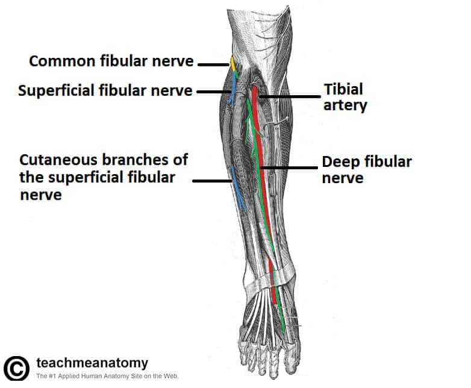

# MMA-UFC-Dataset
MMA UFC Dataset from Kaggle 
(https://www.kaggle.com/datasets/rajeevw/ufcdata/versions/2?resource=download)

This small project started as a pet project to understand the evolution of lower body attacks in UFC. As a fan, I couldn't stop notice the rise of the calf kicks and leg checks. The question this project aims to answer is: Are calf kicks taking over modern UFC?

A way I found to answer this curiosity was to find a suitable dataset for the purpose. I was able to find a dataset from Kaggle which was parsed from the ufcstats website using beautifulsoup. The data include stats from different oponents, represented as R for red fighter and B for blue. R_ and B_ prefix signifies red and blue corner fighter stats respectively.

# Backstory of the effectiveness of leg kicks

The shinbone is one of the largest bones in the body but its not as sturdy as other bones. Elite boxers can generate a huge amount of force with kicks, much more than any punch could ever deliver. A direct it to soft tissue or bone can be very damaging and painful. Most fighters have contioned themselves to desensitivize shins by hitting their shinbon on purpose with bottles, metal poles, or heavy bags. This makes the fibers of the bone grow denser and scar tissue to build around it. The nerves around the bones deaden and dull the pain.

## Peroneal Nerve

The target are for these kicks is the area below the knee where the peroneal nerve travels exposed to the skin surface. It is also here that this nerve splits into the superficial peroneal nerve and deep peroneal nerve. These nerves supply sensation to the outside of the shin and foot.

The superficial peroneal nerve powers the muscles responsible for ankle rotation and the deep peroneal nerve powers the muscle responsible for dorsiflexion and toes. Damaging these nerves not only causes excruciating pain but nullifies the fighers stance, as he isn't able to properly stand his balance.

# Mann-Kendall test

M-K test will be used to evaluate if there is a trend in a time series.
> The Mann Kendall Trend Test (sometimes called the M-K test) is used to analyze data collected over time for consistently increasing or decreasing trends (monotonic) in Y values.

How it works:

- The null hypothesis, for this test is that there is no monotonic trend
- The alternate hypothesis is that there is a trend, this trend can be positive, negative or non-null.

Assumptions:

Because this is a non parametric test we do not require to make prior distribution test. The algorithm doesn't require a lot of data points either and can work well with just 4 or 5 data points. However, some key assumptions are required when processing the data:

- Each data point should represent a single time frame. If there's a case where multiple time points are retrieved per time period (year, day, month), a representative number should be used instead. The authors suggest the median as the least biased number.
- The variation of the sampling depth should not be large enough to produce bias in itself. For example, considering different time periods, where the sampling size varies greatly (ex. 1 sample vs 10 samples) there can be some bias induced either because the 1 combat was not a good representation (outlier) or because the value chosen to represent the 10 samples is not meaningful (altough it should be mitigated with robust estimators such as median vs mean).
  > In statistics, sampling bias is a bias in which a sample is collected in such a way that some members of the intended population have a lower or higher sampling probability than others.
  
  An inate source of bias is the natural selection of some fighters, which due to multiple reasons can have more fights per year than others.

 ## Approaches to statistically test this hypothesis:

 - Test the evolution of the total leg attacks using Mann-Kendall test
Simply gather the total leg attacks by fighter, group it by year and consider the median value.
  - This considers sazonality is non existent
  - This considers there is not effect of covariates (factors that would influence the total leg attacks such as fighter, weightclass and fighter type)
  - There is only one data point per time period (year). Considering we have multiple time periods, the median value is considered

 
